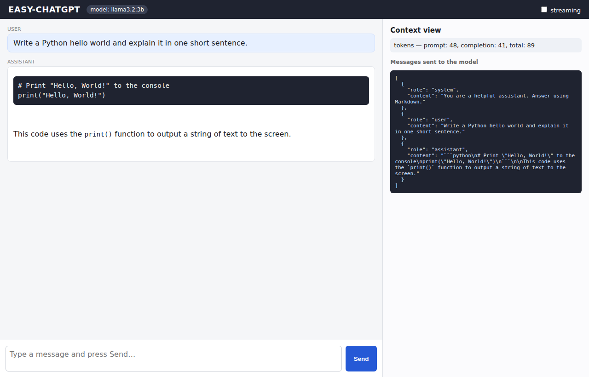

# Semana 1 — Ejercicio 5: EASY-CHATGPT

**Alumno:** Josep Coll
**Repositorio:** https://github.com/carco5/ludo-engsoft — código en `week-01/ex-05-easy-chatgpt/`
**Curso:** Transformers, LLMs, RAG and Agents: From Theory to Production (BSC × UPC)

## Qué he construido

Un pequeño servidor de chatbot. Un backend **FastAPI** hace de *proxy* entre el navegador y el LLM: el frontend nunca llama al modelo directamente — llama a FastAPI, que llama al LLM por la API compatible con OpenAI (configurada solo vía `.env`) y devuelve la respuesta. El frontend es **JavaScript + HTML + CSS vanilla**, renderiza las respuestas en **Markdown**, y tiene una **vista de contexto** que muestra el array exacto de `messages` enviado al modelo y el uso de tokens que vuelve. Arranca con `docker compose up` en el puerto 6661, e implementa el endpoint baseline (bloqueante) y el avanzado (streaming SSE).

## Captura — EASY-CHATGPT funcionando

## Con qué modelo dirigí el agente de código, y por qué

Construí EASY-CHATGPT dirigiendo un modelo de código capaz, en vez de escribirlo a mano. Hace falta un modelo capaz porque un modelo local pequeño no puede montar de forma fiable un FastAPI + frontend + Docker que funcione; el modelo local pequeño se reserva para los experimentos, no para dirigir el agente. Mi trabajo fue decidir qué construir (la forma del proxy, la vista de contexto, el streaming), leer los archivos que producía, ejecutarlo y arreglar lo que no funcionaba.

## Una cosa que salió mal y que detecté y corregí

Conseguir que arrancara con `docker compose up` falló al principio: el chat devolvía `502 Bad Gateway`. Había dos problemas reales y relacionados:

1. Desde dentro del contenedor, el endpoint del LLM no puede ser `localhost` — eso es el propio contenedor. Tiene que ser `host.docker.internal`, que llega a la máquina anfitriona.
2. Aun así devolvía `404 model not found`. `host.docker.internal` apunta al Ollama del **host**, y en mi máquina el Ollama del host sirve un modelo distinto (`llama3.2:3b`) del que yo había puesto al principio en `.env`. Lo detecté leyendo el error del proxy y lo corregí poniendo en `MODEL` (en `.env`) un modelo que el Ollama del host sí sirve (comprobado con `ollama list`).

Tras esas dos correcciones, `docker compose up` funcionó de principio a fin: navegador → FastAPI → Ollama del host → respuesta.

## Una cosa que querría que hiciera a continuación

Le daría historial de chat por usuario y dejaría que sacara respuestas de mis propios documentos (RAG) y que llamara a herramientas — que es justo a donde va la Semana 2.
