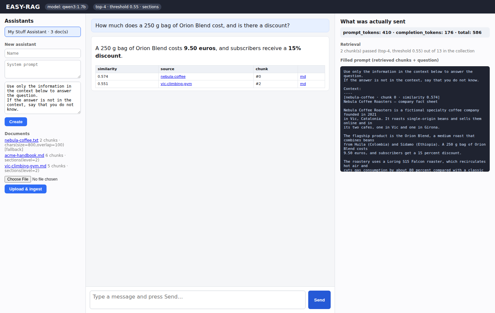
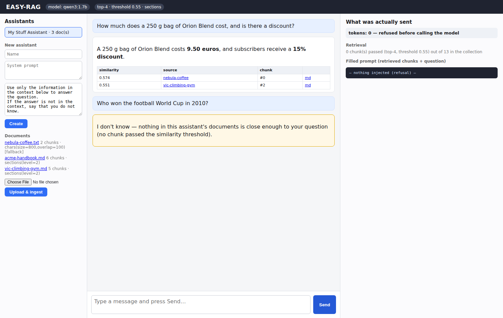

# Week 2 — Final Project: EASY-RAG

**Student:** Josep Coll
**Repository:** https://github.com/carco5/ludo-engsoft — code at `week-02/easy-rag/`
**Course:** Transformers, LLMs, RAG and Agents: From Theory to Production (BSC × UPC)

## How ingestion and retrieval flow through the app

**Ingestion** (on upload): file → **markitdown** converts it to markdown → the
original *and* the distillation are stored under `/static/docs/` (so answers
can link back) → the markdown is chunked — `sections(level=2)`, falling back to
`chars(800/100)` for documents without headings → each chunk is inserted into
the assistant's own collection (via the provided `collections-manager`, one
collection per assistant) with metadata: doc URL, title, md URL, chunk number,
chunking strategy, ingestion date.

**Retrieval** (on every turn): the user's message **is** the query → the
collection returns the top-K chunks over the similarity threshold → they are
formatted with their provenance and put into the same `{context}` /
`{user_input}` template as Exercise 1 → one stateless chat-completions call.
The UI keeps only bare turns; if **nothing** passes the threshold the backend
answers "I don't know" **without calling the model** (zero tokens).

## The settings I chose

- **Chunking: `sections(level=2)`, fallback `chars(800/100)`** — in Exercise 3
  section chunks retrieved strictly better on structured documents (top
  similarity 0.81 vs 0.72), and the fallback covers plain files; both are
  `.env` configuration.
- **K = 4** — my documents answer any one question inside one or two sections;
  four gives the model context without paying for chunks it will not use.
- **Threshold = 0.55** — measured in Exercise 3: off-topic questions scored up
  to 0.54 against this corpus (in-language ones highest), real answers 0.57+,
  so 0.55 sits just above the noise floor without starving real questions.

## Provenance — and the honest refusal

 

**Left — provenance.** Three documents ingested (13 chunks). *"How much does a 250 g bag of Orion
Blend cost?"* — answered from `nebula-coffee.txt` chunk 0 (similarity 0.574),
with the source shown as a clickable `/static` link. Retrieval picked the right
document; a "Prices" chunk from the *gym* document also crossed the gate at
0.551 (price questions look alike), and the grounded prompt still answered
only from the coffee data — the threshold is the first line of defense, the
system prompt the second.

**Right — honest refusal.** *"Who won the football World Cup in 2010?"* — no
chunk passed 0.55, the assistant said it does not know, and the usage pane
reads **0 tokens — refused before calling the model**.

## prompt_tokens, compared with Exercise 1

In Exercise 1 the **whole file rode along every turn** and history grew on top:
356 → 401 prompt tokens for a 967-char document — and that number scales with
the document, not the question. In EASY-RAG, with **three documents (13
chunks)** in the collection, my turns cost **367–537 prompt tokens** each —
only the retrieved chunks ride along, so the cost now scales with the *answer*,
not with the corpus: I could ingest fifty more documents and a turn would still
cost roughly the same. That difference is what this week was about.
