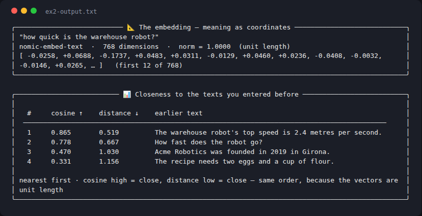

# Week 2 — Exercise 2: Play with the Embeddings Explorer

**Student:** Josep Coll
**Repository:** https://github.com/carco5/ludo-engsoft
**Course:** Transformers, LLMs, RAG and Agents: From Theory to Production (BSC × UPC)

Demo: `week-02/demos/03-embeddings-explorer/` · model `nomic-embed-text`
(768 dimensions, unit-length vectors) through local Ollama.

## Task 1 — Meaning, not words

After `/seed`, I typed the paraphrase **"how quick is the warehouse robot?"** —
it shares almost no words with the seeded sentences, yet it landed at the top
against *"The warehouse robot's top speed is 2.4 metres per second."* with
cosine **0.865**, while the recipe seed sat at the bottom at **0.331**. Then I
typed an off-topic recipe line ("Mix the sugar with the melted butter…") and it
fell straight to the other recipe sentence (0.601) with every robot sentence
down at ~0.36. The numbers track what a sentence *means*, not which words it reuses.

## Task 2 — Two names, one geometry

The two measures always rank identically because the model returns
**unit-length vectors** (the demo prints `norm = 1.0000`), and on a unit sphere
Euclidean distance is a fixed function of cosine — `distance² = 2·(1 − cosine)`
— so one is just a monotonic re-labelling of the other and the order can never
differ.

## Task 3 — Trying to fool it

- **As expected:** the English paraphrase *"The warehouse robot is very fast."*
  scored **0.931** against the top-speed sentence — same meaning, different
  words, nearest neighbour.
- **The surprise — negation and opposites barely register.**
  *"I love this film"* vs *"I hate this film"*: **0.706**, by far each other's
  nearest neighbour. And *"The robot is not fast at all."* landed at **0.871**
  next to *"How fast does the robot go?"* and **0.815** next to *"The warehouse
  robot is very fast."* — opposite truth value, almost identical position.
  Cross-language was weaker than I expected the other way: the Spanish
  *"El robot del almacén es muy rápido."* only reached **0.645** against its
  exact English translation.

**What it tells me:** an embedding captures the *topic* of a sentence (robots,
speed, films) very well, but not its *polarity* (love/hate, fast/not-fast) —
and it is partially language-sensitive. So retrieval-by-embedding will happily
fetch a chunk that *denies* what the question asks, and the model must read it;
the geometry alone cannot be trusted to know true from false.
