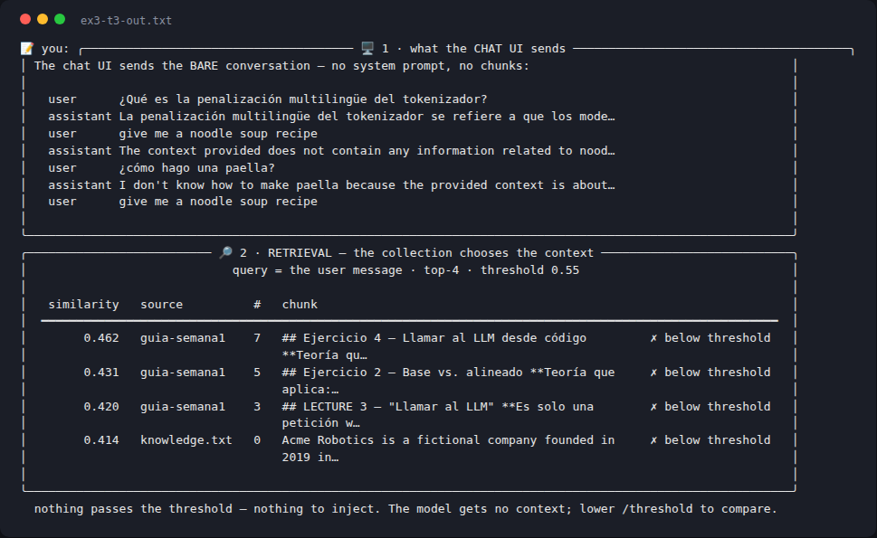
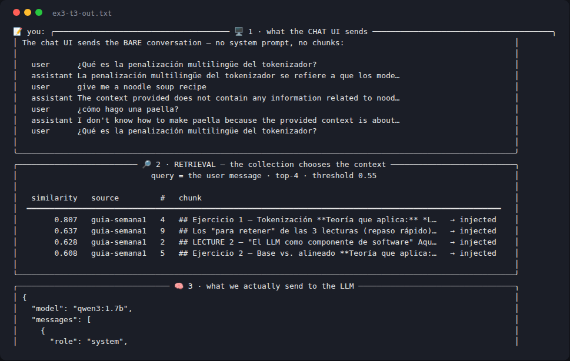

# Week 2 — Exercise 3: Collections, ingestion, and the retrieval gate

**Student:** Josep Coll
**Repository:** https://github.com/carco5/ludo-engsoft
**Course:** Transformers, LLMs, RAG and Agents: From Theory to Production (BSC × UPC)

Demos: `04-collections-explorer`, `simple-dynamic-rag`, `05-embeddings-rag-explorer`
— all on local Ollama (`nomic-embed-text` + `qwen3:1.7b`).

## Task 1 — What persisted, and where it lives

I `/add`-ed four chunks (source `josep-notes`), quit, ran the explorer again — and
`/list` showed all four still there: **the embeddings and their metadata persisted
between the two runs, in the `collections-store/` directory next to the demo, where
Chroma keeps a `chroma.sqlite3` database plus a folder holding the vector index.**
Querying with words the chunks never use surfaced the right one: *"my computer has
no graphics card"* → the no-GPU/CPU chunk, at 0.551.

## Task 2 — One document, two chunkings

My real document: `guia-semana1.md`, my week-1 class notes (18,119 chars of
markdown after conversion).

| strategy | chunks | top similarity (3 questions) | prompt_tokens (3 turns) |
|---|---|---|---|
| `chars(size=800,overlap=100)` | **26** | 0.72 · 0.67 · 0.58 | 1194 · 1413 · 1647 |
| `sections(level=2)` | **10** | **0.81 · 0.72 · 0.65** | 2320 · 1715 · 2157 |

**Observation:** `sections` retrieved better here — every question's top hit was
exactly the right `##` section, with clearly higher similarity (0.81 vs 0.72) and
cleaner answers; with `chars` the window cut mid-topic (one answer mixed in numbers
from a neighbouring experiment inside the same 800-char window). The price of
`sections` is bigger chunks: ~500–900 more prompt tokens per turn. Structure-aware
cutting wins when the document *has* structure.

## Task 3 — The threshold band

Pointing the explorer at my `bysections` collection:

- real question (*"¿Qué es la penalización multilingüe del tokenizador?"*):
  top chunk **0.807**, next ones 0.61–0.64;
- off-topic in English (*"give me a noodle soup recipe"*): top **0.462** —
  and at the default threshold 0.4 all four garbage chunks were **injected**,
  costing 2,547 prompt tokens for a groundless answer;
- off-topic in Spanish (*"¿cómo hago una paella?"*): top **0.539** — notably
  higher, because sharing the document's language pushes similarity up.

**The band I found: ≈ 0.55.** At `/threshold 0.55` both off-topic questions
inject nothing (✗ below threshold on every row) while the real question still
gets all its chunks; at 0.7 only its best chunk survives, and at 0.85 even
that one starves.

 

**Why this number cannot be hard-coded:** it belongs to *this* embeddings
model, *this* corpus and even the query language — my own off-topic floor moved
from 0.46 to 0.54 just by switching the question to Spanish, so any fixed
universal threshold would either let noise in or starve legitimate questions
somewhere else.
