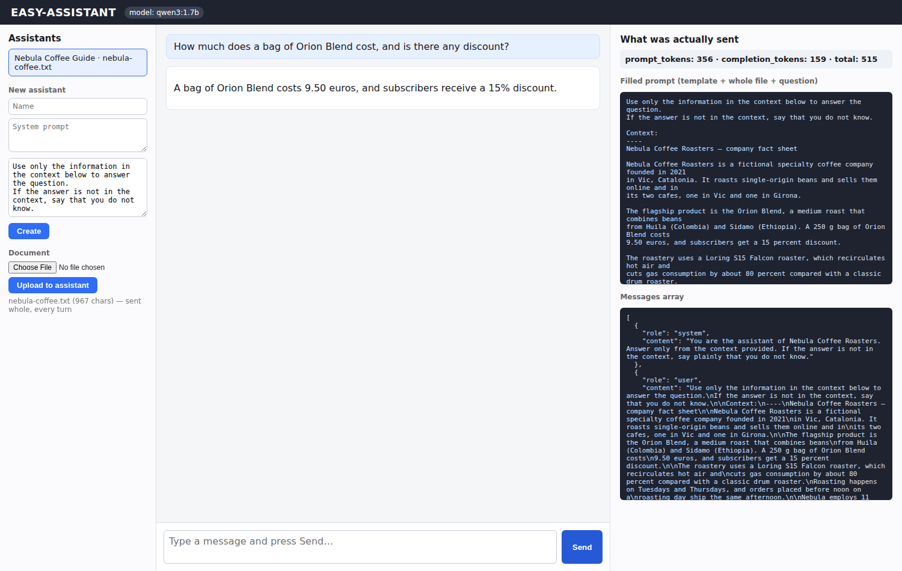
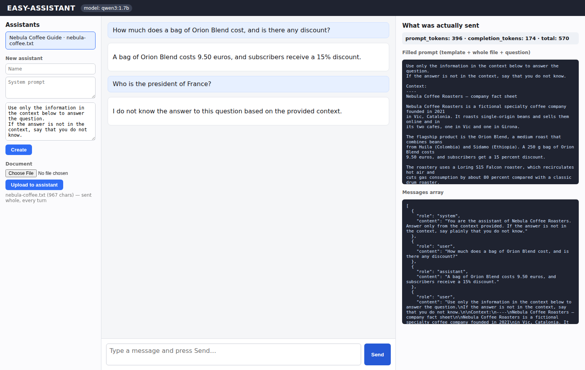

# Week 2 — Exercise 1: EASY-ASSISTANT

**Student:** Josep Coll
**Repository:** https://github.com/carco5/ludo-engsoft — code at `week-02/ex-01-easy-assistant/`
**Course:** Transformers, LLMs, RAG and Agents: From Theory to Production (BSC × UPC)

## The assistant I built

**Name:** Nebula Coffee Guide · document: `sample-docs/nebula-coffee.txt` (967 chars,
fact sheet of a fictional coffee roastery). **System prompt:** *"You are the assistant
of Nebula Coffee Roasters. Answer only from the context provided. If the answer is not
in the context, say plainly that you do not know."* **Prompt template:**

```
Use only the information in the context below to answer the question.
If the answer is not in the context, say that you do not know.

Context:
----
{context}
----

Question: {user_input}
```

## In action — answering from the document, and failing outside it

 

**Left — correct:** *"How much does a bag of Orion Blend cost, and is there any
discount?"* → **"9.50 euros… 15% discount."** Both facts come from the file; the
context pane shows the whole file inside the prompt that was sent, every turn.
**Right — failing, usefully:** *"Who is the president of France?"* → **"I do not
know the answer to this question based on the provided context."** The failure is
useful because it proves the assistant answers from **my document**, not from the
model's training — it only knows what I put into its context.

## The prompt_tokens number

First turn: **356 prompt tokens** for a 15-token question — the other ~340 are
the whole document plus the template and system prompt. Second turn: **401** —
it *grew*, because the whole file was sent **again** plus the previous bare
turns. With this 967-char file that is cheap; with a 200-page manual it would
be hundreds of thousands of tokens **on every turn**, so pasting the whole file
cannot scale — next step is retrieving only the relevant pieces (dynamic RAG).
