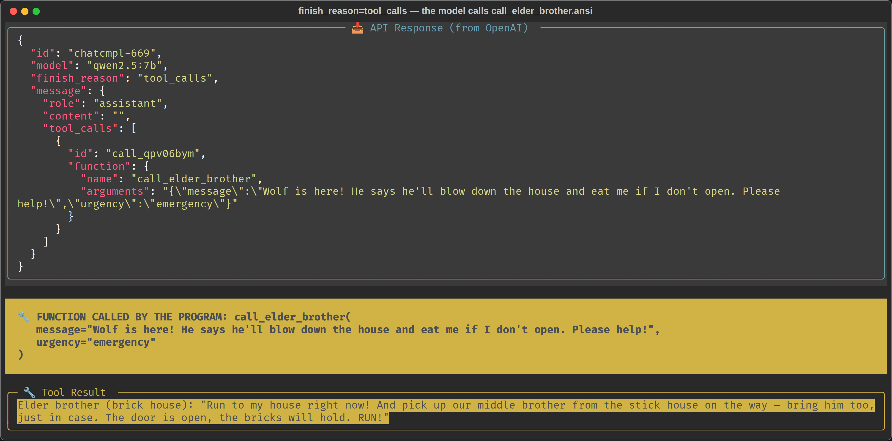
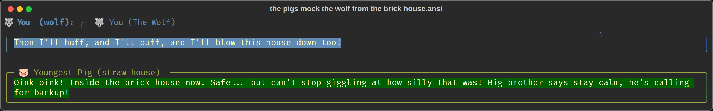

# Week 3 — Exercise 1: The Straw House Emergency

**Student:** Josep Coll
**Repository:** https://github.com/carco5/ludo-engsoft — code at `week-03/straw-house/`
**Course:** Transformers, LLMs, RAG and Agents: From Theory to Production (BSC × UPC)

The assistant is the **youngest pig, in the straw house**. `call_hunter` is gone; the tool is
`call_elder_brother`, whose description says who he is, where he is, why he is worth calling —
*and when not to call him*. Run on local Ollama, `qwen2.5:7b`, no key.

## A knock is not an emergency

Message 1 was `knock knock`. The response came back with `finish_reason: "stop"` and no
`tool_calls`: *"Who's there? Just answer the door, silly knock. No need to call for now."*

## The threat — and the call the model wrote itself

## Back from the brick house, laughing

After the tool result entered the context the pig's answers changed shape without being told:
*"Oink oink! On my way to the brick house, huffing and puffing, I'll get us all safe!"* — it had
a plan it never had before, the one that came back through the `tool` message.

## At which message did the model decide to call, and why not earlier?

At **message 2**, the moment the wolf named himself and threatened to blow the house down —
not at `knock knock`, because a knock carries neither an identification nor a threat, so the
condition written into the tool's description (*"use this when the wolf is actually threatening
you… not for an unidentified knock"*) was simply not met, and the pig had nothing to tell his
brother yet.

## Who executed the function — the model or the program?

**The program.** The API response above contains no result at all: only a *request* —
`content: ""`, `finish_reason: "tool_calls"`, and `arguments` as an unparsed JSON **string**.
The brother's sentence appears nowhere in it. It exists only because my Python looked the name
up in `DISPATCH`, ran `call_elder_brother(**args)`, and appended the return value as a
`role: "tool"` message; the model saw the answer on the *next* request, when I had already put
it in the context.

> **A note on the driver.** `qwen3:1.7b` and `llama3.2:3b` phone the brother on a plain
> `knock knock`; `qwen2.5:3b` fails the other way — faced with the real wolf it *announces*
> that it will call and calls nothing, which is exactly the tool-less pig of scenario 1.
> Same file, same prompt, same tool: only the engine changed. Lecture 3.2 — *the loop is
> trivial, the driver is not* — measured on my own machine.
