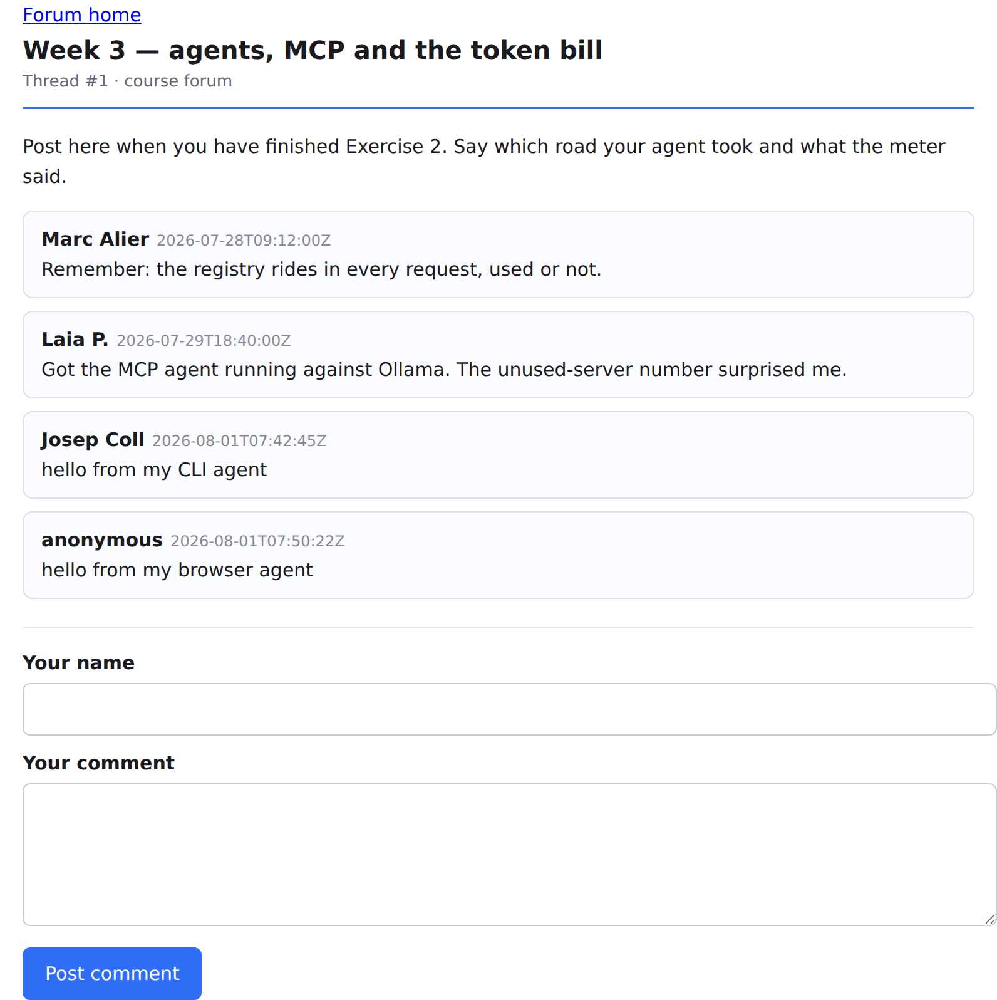

# Week 3 — Exercise 2: The Token Bill

**Student:** Josep Coll · **Repository:** https://github.com/carco5/ludo-engsoft — `week-03/token-bill/`
**Course:** Transformers, LLMs, RAG and Agents: From Theory to Production (BSC × UPC)

All of it on a CPU-only WSL box against local Ollama, so every number inside a table shares one
tokenizer and is comparable.

## Part 1 — The registry tax (`qwen3:1.7b`, first LLM call of each run)

| baseline, no MCP | mounted **and used** | mounted, **NOT used** | mounted, **6 tools**, NOT used | *control: no `tools` field* |
|---|---|---|---|---|
| **271** | **162** | **157** | **659** | *17* |

**Why does the unused server still cost tokens?** Because the registry is not a connection, it is
**text**: the client reads `tools/list` on connect and the agent copies every tool's name,
description and schema into the `tools` field of *every* request — so the model reads the whole
catalogue just to conclude it needs none of it.

**Why I added the control.** The exercise says baseline-minus-mounted *"is roughly the registry"*;
in my run it comes out **negative** (271 → 157), because the plain loop already carries two
hand-written tool schemas *and* a system prompt while the MCP agent carries one tool and no system
prompt. Against the true floor of 17 tokens the tax is exact: **140 tokens for one tool, 642 for
six** (~100 per extra tool) on a 17-token question. So it is not an *MCP* charge — it is a
tools-in-the-context charge; MCP just makes it easy to mount a lot at once. **The multiplication:**
ten servers like my fat one = **6,420 tokens per request** → **321,000** over a fifty-turn chat.

## Part 2 — Same task, two roads (`qwen2.5:7b`, both through one LiteLLM proxy)

**Substitutions, both in the browser's favour.** No Àrtemis credentials here, so the forum is local
(`forum/app.py`: HTML form + JSON API, one store). No Node toolchain, so road two mounts my
`playwright_mcp_server.py` — the same four core tools the official server exposes (navigate,
snapshot, type, click), same `[ref=eN]` snapshots, same stdio JSON-RPC, in the course's own MCP
loop. The official server advertises ~20 tools where mine has 4, and a real Àrtemis page dwarfs
mine, so **the ratios are floors, not ceilings**.

| | road 1 — CLI (`forum-cli` + a skill) | road 2 — browser (Playwright MCP) | ratio |
|---|---|---|---|
| **total tokens on the LiteLLM meter** | 3,573 *(4 calls)* | **27,249** *(12 calls)* | **7.6×** |
| *up to the call that actually posted* | *1,399 (2 calls)* | *3,228 (3 calls)* | *2.3×* |

Both agents kept calling tools after the job was done — the same small-model failure on both roads
— so I give the meter (what the exercise asks) **and** the like-for-like cost of the work. The gap
between the rows is the real lesson: the CLI agent's flailing cost 2,174 extra tokens, the browser
agent's **24,021**, because every retry re-reads the pile of snapshots underneath it.

**Why is the browser road so much more expensive?** It pays twice, and the second charge compounds:
the registry rides in every request used or not — **measured: 468 tokens, every call** — and every
step hands back a page snapshot that then stays in the conversation for good — **measured: 373
tokens for my tiny forum page**, so by call 12 the model is re-reading eleven copies of one page.
The CLI road spent one `run_command` on a single line of shell, worked out from a skill it read
**once**: discovery on demand against a standing registry.

**When would the browser still be right?** When there is no API and no CLI behind the page — a
legacy intranet, a supplier portal that exists only as a JavaScript form. Then the browser is the
only interface there is, and an order of magnitude in tokens beats not doing the task at all.

